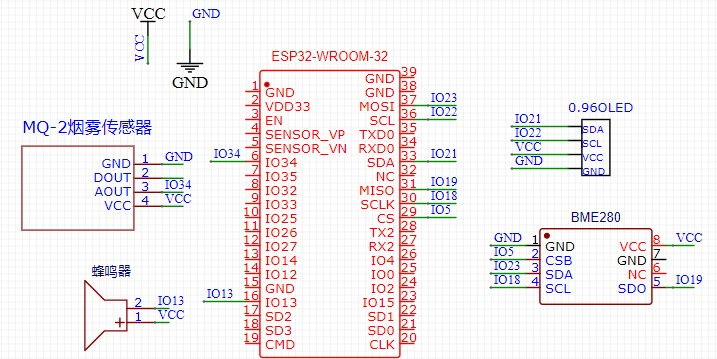
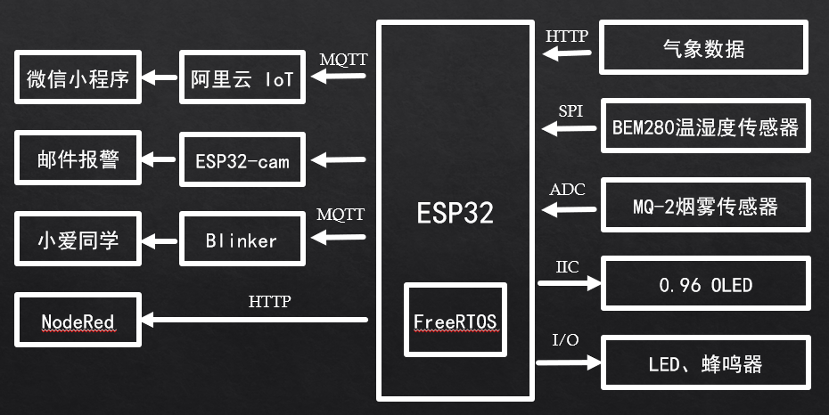

# ESP32环境检测器
## 简介
使用ESP32作为主控芯片，开发环境为 Arduino,嵌入式实时操作系统FreeRTOS,云平台为阿里云物联网（阿里生活物联网飞燕）,服务端由Java实现，前端分别由微信小程序和NodeRed Dashboard 展示相关信息，最后实现一个简单的环境检测器。
## 硬件材料
* ESP32主控芯片
* BME280温湿度气压传感器
* MQ-2 烟雾传感器
* 0.96寸OLED屏幕
* LED 发光二极管
* 蜂鸣器
* 电阻
* 杜邦线
* 面包板
## 硬件程序框架

## 主要功能
* WIFI配网：ESP32可以作为服务器提供配网页面实现配网
* 天气API获取：ESP32发送HTTP请求，使用ArduinoJSON处理数据
* MQTT客户端：连接阿里云平台，阿里云的封装了阿里云接入的函数（只需三元组信息）
* Blinker客户端：主要通过点灯科技接入第三方语音，实现小米小爱同学联动
* 环境数据读取：通过BME280、MQ-2获取温湿度等数据
* OLED显示功能: 在OLED屏幕上面显示相关的信息
## 全部资料
链接：https://pan.xunlei.com/s/VN-YXMz8jSMzedzqGzchDagcA1
提取码：6rx8
复制这段内容后打开手机迅雷App，查看更方便
